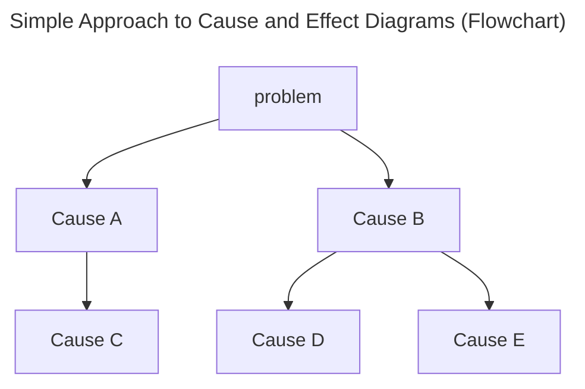

```mermaid
---
title: Simple Approach to Cause and Effect Diagrams (Flowchart)
---
flowchart TD
    a[Cause A]
    b[Cause B]
    c[Cause C]
    d[Cause D]
    e[Cause E]
    problem --> a & b
    a --> c
    b --> d & e
```
