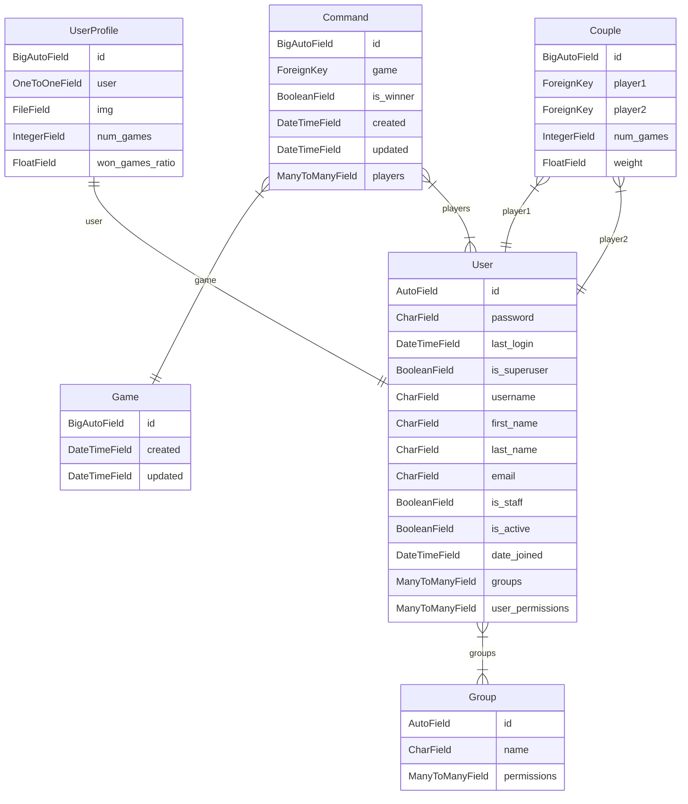

```mermaid
---
Django ER Diagram
---
erDiagram
Group {
    AutoField id
    CharField name
    ManyToManyField permissions
}
User {
    AutoField id
    CharField password
    DateTimeField last_login
    BooleanField is_superuser
    CharField username
    CharField first_name
    CharField last_name
    CharField email
    BooleanField is_staff
    BooleanField is_active
    DateTimeField date_joined
    ManyToManyField groups
    ManyToManyField user_permissions
}
UserProfile {
    BigAutoField id
    OneToOneField user
    FileField img
    IntegerField num_games
    FloatField won_games_ratio
}
Command {
    BigAutoField id
    ForeignKey game
    BooleanField is_winner
    DateTimeField created
    DateTimeField updated
    ManyToManyField players
}
Game {
    BigAutoField id
    DateTimeField created
    DateTimeField updated
}
Couple {
    BigAutoField id
    ForeignKey player1
    ForeignKey player2
    IntegerField num_games
    FloatField weight
}
User }|--|{ Group : groups
UserProfile ||--|| User : user
Command }|--|| Game : game
Command }|--|{ User : players
Couple }|--|| User : player1
Couple }|--|| User : player2
```
