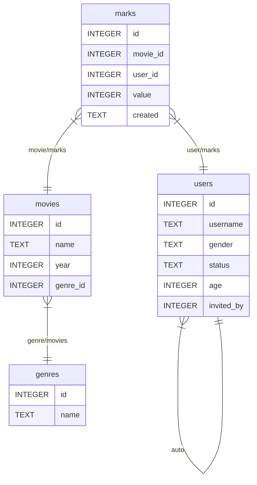

```mermaid
---
Django ER Diagram
---
erDiagram
genres {
    INTEGER id
    TEXT name
}
movies {
    INTEGER id
    TEXT name
    INTEGER year
    INTEGER genre_id
}
users {
    INTEGER id
    TEXT username
    TEXT gender
    TEXT status
    INTEGER age
    INTEGER invited_by
}
marks {
    INTEGER id
    INTEGER movie_id
    INTEGER user_id
    INTEGER value
    TEXT created
}
movies }|--|| genres : "genre/movies"
marks }|--|| movies : "movie/marks"
marks }|--|| users : "user/marks"
users }|--|| users : "auto"
```
